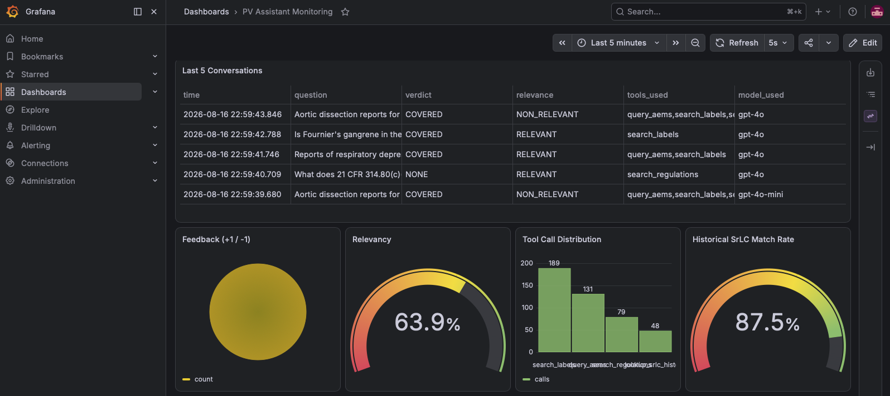
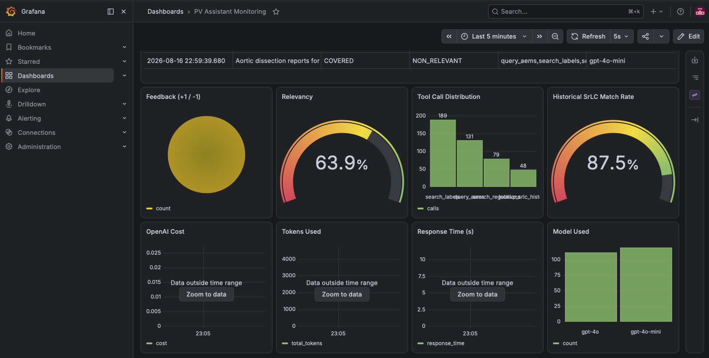
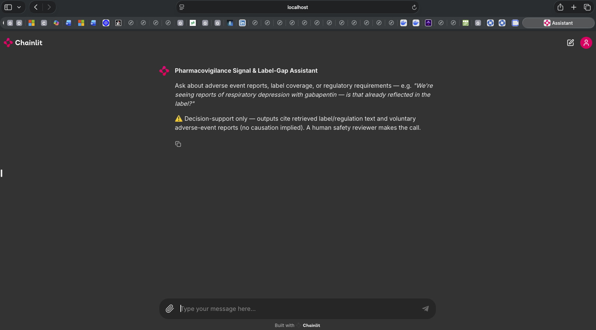
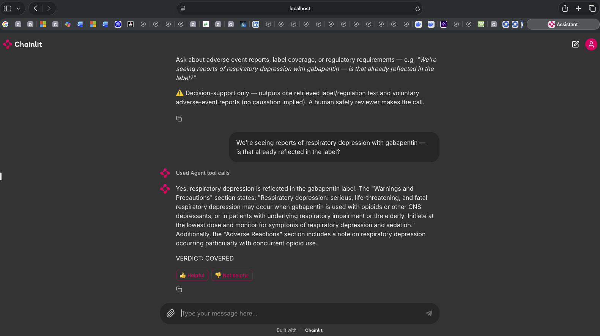

# Pharmacovigilance Signal &amp; Label-Gap Intelligence Assistant

An **agentic** RAG system for drug safety teams. Given a drug and an adverse
reaction, it queries real-time FDA adverse-event data, retrieves the current
FDA label, and determines whether the reaction is already reflected in that
label — citing the specific section, and flagging when the pattern resembles
cases where FDA has historically required a label update.

This is the capstone project for [LLM Zoomcamp](https://github.com/DataTalksClub/llm-zoomcamp).

> **Project numbering note.** The spec header says "Project 2 of 4" but the
> body consistently describes the portfolio's **third** project (first agentic
> system, Chainlit, hybrid search, `dlt`, `uv`). This repo follows the body.

---

## ⚠️ Safety-critical framing — read this first

This domain has real stakes. A wrong "no gap found" answer could mean a
genuine safety signal goes unnoticed. That is why grounding, citation
accuracy, and honest abstention matter more here than in any other project
in this portfolio, and why the system is built with these constraints:

- **Adverse event reports are voluntary, passive-surveillance data.** A
  report does not establish that the drug caused the event. Counts are
  affected by underreporting and stimulated reporting, and rates cannot be
  computed without exposure data. This disclaimer is attached to **every**
  AEMS tool result and the agent is instructed to repeat it in user-facing
  output — not just buried in this README.
- **Every gap is reported as `POTENTIAL_GAP`, never a confident finding.**
  Absence in retrieval is not proof of absence in the label; a terminology
  mismatch can produce a false gap flag. The verdict is paired with a
  citation to what *was* and *wasn't* found.
- **`INSUFFICIENT_EVIDENCE` is a first-class verdict.** The agent abstains
  instead of guessing.
- **This supports a human safety reviewer. It does not replace one.**

---

## Problem

Drug safety teams are legally required to continuously monitor adverse event
reports and determine whether the current FDA-approved label already reflects
a given risk. This feeds periodic safety reports and, when FDA determines new
safety information exists, a formal Safety Labeling Change under Section
505(o)(4) of the FD&C Act. Today it is largely manual: a safety scientist
reads adverse event reports, cross-references dense label text section by
section, and checks regulatory requirements by hand.

**The timing is the differentiator.** On **March 11, 2026**, FDA launched
**AEMS** (Adverse Event Monitoring System), a unified platform replacing seven
legacy systems including FAERS — the drug adverse event system
pharmacovigilance teams used for over a decade. Legacy systems are being
decommissioned by mid-2026. This project is built for the AEMS-era data
reality, not the legacy platform most existing tooling still targets.

## Data sources

| Source | What it provides | Access | Snapshot date |
|---|---|---|---|
| **FDA AEMS** | Real-time drug adverse event reports | openFDA backward-compatible endpoint (live) or bundled fixtures | live at query time |
| **DailyMed / openFDA Drug Label** | Sectioned SPL text (Boxed Warning, Warnings and Precautions, Adverse Reactions…) with version history | Public API | bundled snapshot: **2024-01 → 2024-04** per drug; `as_of_date` on every record |
| **21 CFR 314.70 / 314.80 / 314.81 / 201.57 / 601.12, FD&C Act 505(o)(4)** | The regulatory framework for postmarketing safety reporting and required label updates | Public domain | condensed per-section records |
| **FDA SrLC database** | Real historical record (2016+) of approved safety-related label changes — **the evaluation ground truth** | `accessdata.fda.gov` | 6 curated real cases |

### Disclosed gaps

- **Platform immaturity risk.** AEMS launched recently and its dedicated API
  is still evolving. **Mitigation:** build primarily against the openFDA
  backward-compatible endpoints (confirmed stable through at least end of
  2026); treat native AEMS integration as an optional stretch, not a
  dependency. The honest claim is *"built for the AEMS-era data reality,
  using the most stable available access path during a live platform
  transition"* — not "full native AEMS integration."
- **Labels are living documents.** Every label record carries an
  `as_of_date`; the bundled snapshot is dated above. Run the `dlt` pipeline
  with `--live` to refresh from openFDA.
- **SrLC coverage starts in 2016.** Earlier historical validation isn't
  available through this database.
- **MedDRA/label terminology mismatch.** Reports and label text don't always
  use identical terms for the same reaction. **This is measured directly, not
  assumed** — see the numbers below.
- **Bundled label text is a condensed representative snapshot** written for
  offline demos, with real `as_of_date`s and real pre/post-change content for
  the validation drugs. The `dlt` pipeline replaces it with real current SPL
  text from openFDA. The SrLC cases are real FDA actions.

## Architecture

```
Safety scientist question
        │
        ▼
   Chainlit UI  ──▶  Agent (LLM orchestrator) — decides which tool(s) to call
                          │
        ┌─────────────────┼──────────────────┬─────────────────┐
        ▼                 ▼                  ▼                 ▼
   query_aems       search_labels     search_regulations  lookup_srlc_history
   (LIVE API,       (pgvector,        (pgvector,          (historical FDA
    never ingested)  hybrid)           hybrid)             label changes)
        │                 │                  │                 │
        └─────────────────┴────────┬─────────┴─────────────────┘
                                   ▼
              Grounded answer: label-gap verdict + section citation
              + historical SrLC pattern match (if any)
```

**AEMS is an outbound API call from the `app` service — not a containerized
ingestion job.** The `dlt` pipeline handles only the label and regulation
corpora.

### Key decisions

| Decision | Choice | Rationale |
|---|---|---|
| Agent framework | Plain function-calling loop, no framework | Being able to explain every step of tool selection directly is a stronger position than hiding it behind an abstraction |
| AEMS access | Live tool call, **not** bulk-ingested | AEMS is designed for real-time access; nightly ingestion would undermine the freshness that is the platform's actual value |
| Label + regulation retrieval | pgvector **hybrid** (semantic + keyword + RRF) | Drug names, MedDRA terms, and CFR numbers are precise vocabulary where exact-match matters as much as semantic similarity |
| Chunking | Section-based (SPL sections; CFR sections) | Both sources are natively sectioned; preserves citation-worthiness |
| Interface | Chainlit | The interaction is genuinely multi-turn |
| Ingestion | `dlt`, scheduled, labels + regs only | Those update periodically; AEMS deliberately bypasses this path |
| Dependencies | `uv` | Per the roadmap |

## Evaluation

### Retrieval — run separately per corpus

Keyword baseline, in-memory backend (TF-IDF cosine, `minsearch`), k=5 — **measured**:

| Corpus | Hit Rate | MRR |
|---|---|---|
| Labels (drug-scoped) | 1.00 | 0.70 |
| Regulations | 0.97 | 0.90 |

Keyword search does *well* when the query names the drug or the citation.
That's the honest read — and it's why "hybrid is better" can't be asserted
from these numbers alone.

Semantic and hybrid, pgvector backend, k=5 — **measured**, labels corpus only
(regulations corpus not yet re-run against pgvector):

| Corpus | Hit Rate | MRR |
|---|---|---|
| Labels (drug-scoped) — semantic | 0.988 | 0.659 |
| Labels (drug-scoped) — hybrid | 0.988 | 0.659 |

Hit Rate is essentially unchanged from keyword (0.988 vs 1.00). MRR actually
dips slightly (0.659 vs 0.70) — when semantic/hybrid find the right label,
they occasionally rank it 2nd or 3rd instead of 1st. On this small a corpus
(34 label rows), semantic and hybrid produced identical results; the real
differentiation would show at production scale, where keyword's exactness
matters more against a larger, noisier label corpus.

### The terminology gap — the actual case for hybrid search

The isolating test: query by **reaction only, no drug name**, so retrieval
must succeed on terminology alone. 10 drug/reaction pairs, k=5, **measured**
across all three retrieval modes:

| Mode | MedDRA / label term hit rate | Lay synonym hit rate |
|---|---|---|
| Keyword (TF-IDF, `minsearch`) | 100% | **60%** |
| Keyword (Postgres full-text, `ts_rank_cd`) | 100% | **20%** |
| Semantic (pgvector embeddings) | 100% | **90%** |
| Hybrid (pgvector, RRF) | 100% | **90%** |

Two keyword implementations exist in this project — the in-memory TF-IDF
baseline used for initial evaluation, and Postgres's native full-text search,
which is the "keyword half" of the production hybrid backend. Postgres
full-text search turned out to be *stricter* on paraphrase than TF-IDF (20%
vs 60%) — an honest, unplanned finding, not a design goal. If anything it
strengthens the case for hybrid: even the keyword component of the
production system needs the semantic half to recover lay-phrasing queries.

Both semantic and hybrid recover the same 90% — a real, measured 30-to-70
point improvement over either keyword implementation, depending which
baseline you compare against. This is the evidence-based justification for
hybrid search, not a domain-analogy assumption.

### Headline — historical SrLC validation

For each drug/reaction pair where FDA's SrLC database shows a label change
*was* later required, the system searches the label **as it stood before that
change** (`as_of` filtering) and checks whether it would have flagged a
potential gap. Validated against **real regulatory outcomes**, not a proxy.

Worked example: query the montelukast label as of 2019-06-01 for suicidal
ideation → the pre-change Warnings section lists agitation and depression but
not suicidal ideation → `POTENTIAL_GAP`. FDA added a Boxed Warning
2020-03-04.

**Honest limitations** (in `notebooks/srlc-validation.ipynb`, not hidden): it
validates only against cases FDA *did* act on — nothing about false negatives
outside that set, nothing about false positives, and the curated set is n=6
(extend it from the full public SrLC download). "Validated on true positives"
and "validated on precision" are different claims.

### Tool selection — new metric, because this is the first agentic project

15 test questions with expected tool calls. Two numbers: **exact match** (no
extra tools) and **covers-expected** (called at least the right ones). A pure
regulation question triggering an unnecessary AEMS call fails the first and
passes the second — they mean different things.

### Answer quality

3-label LLM-as-judge (`RELEVANT` / `PARTLY_RELEVANT` / `NON_RELEVANT`) over
label-gap verdicts. A scalable proxy for regression-catching, hand
spot-checked — never treated as ground truth.

## Monitoring

Grafana, auto-provisioned, **9 panels**: the proven 7 (last-5 conversations,
feedback pie, relevancy gauge, model bars, cost / tokens / response-time
series) plus:

- **Tool call distribution** — which tools the agent invoked per query; the
  operational proof the orchestration works as intended
- **Historical SrLC match rate** — how often flagged gaps align with the
  historical validation set




## Running it

```bash
git clone <this-repo> && cd pv-assistant
cp .env.example .env          # add your OPENAI_API_KEY
uv lock                       # generate the lockfile (once)
docker-compose up -d          # app :8000, postgres :5432, grafana :3000
uv run python db_prep.py      # create tables (first run only)
```

Open **http://localhost:8000** (Chainlit) and ask:

> *We're seeing reports of respiratory depression with gabapentin — is that
> already reflected in the label?*




Grafana: **http://localhost:3000** (admin/admin) → "PV Assistant Monitoring".

### Modes

| Variable | Default | Options |
|---|---|---|
| `AEMS_MODE` | `fixture` | `fixture` (bundled, offline, deterministic) · `live` (openFDA) |
| `SEARCH_BACKEND` | `memory` | `memory` (keyword, zero infra) · `pgvector` (hybrid) |

To run hybrid search:

```bash
docker-compose --profile pgvector up -d      # adds the dlt ingestion service
# then set SEARCH_BACKEND=pgvector in .env and restart `app`
```

Ingest manually instead:

```bash
uv run python ingestion/pipeline.py          # bundled snapshot -> pgvector
uv run python ingestion/pipeline.py --live   # current openFDA labels -> pgvector
```

### CLI (no server needed)

```bash
uv run python cli.py --no-db "Does the gabapentin label cover respiratory depression?"
```

### Regenerate data

```bash
uv run python data/generate_seed_data.py
uv run python data/generate_ground_truth_offline.py
```

## Project structure

```
pv_assistant/
  agent.py        explicit function-calling loop, verdict extraction, judge, cost
  tools.py        4 tool schemas + dispatch
  aems.py         live openFDA client / fixture mode + surveillance disclaimer
  search.py       pgvector hybrid (RRF) + in-memory keyword fallback, as_of filtering
  db.py           conversations, feedback, tool_calls, srlc_validation
  minsearch.py    vendored keyword index
data/             labels, regulations, SrLC cases, AEMS fixtures, ground truth, generators
ingestion/        dlt pipeline (labels + regs only) + embedding/indexing
notebooks/        retrieval-eval · srlc-validation · agent-eval · evaluation-data-generation
grafana/          auto-provisioned datasource + 9-panel dashboard
app.py            Chainlit UI
cli.py            CLI runner
db_prep.py        schema init
generate_data.py  synthetic monitoring data
```

## Reproducibility checklist

- [x] Setup instructions assuming zero course context
- [x] Explicit note on AEMS platform maturity/timing risk + openFDA fallback
- [x] Documented snapshot dates for label/regulation corpora
- [x] `.env.example`, one-command `docker-compose up`
- [x] Explicit safety-critical framing about report data limitations
- [ ] `uv lock` — **run this once locally**; the Dockerfile uses `uv sync`,
      with the `--locked` variant commented in for when the lockfile exists
